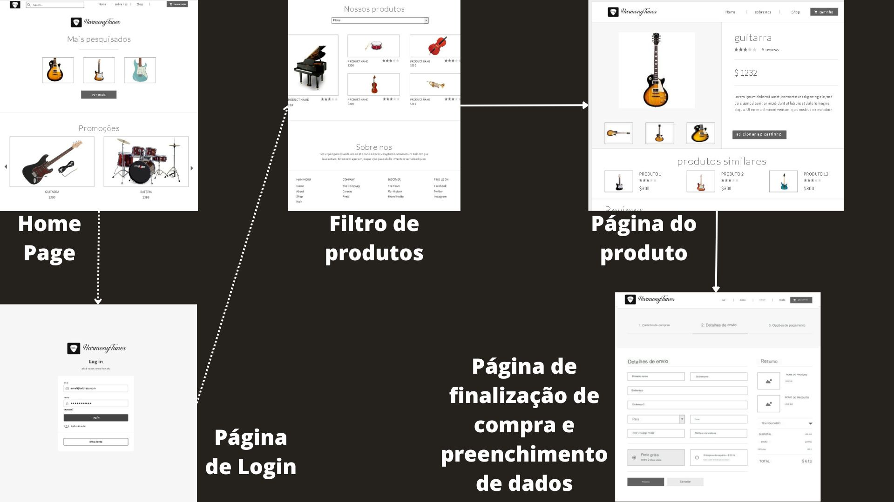
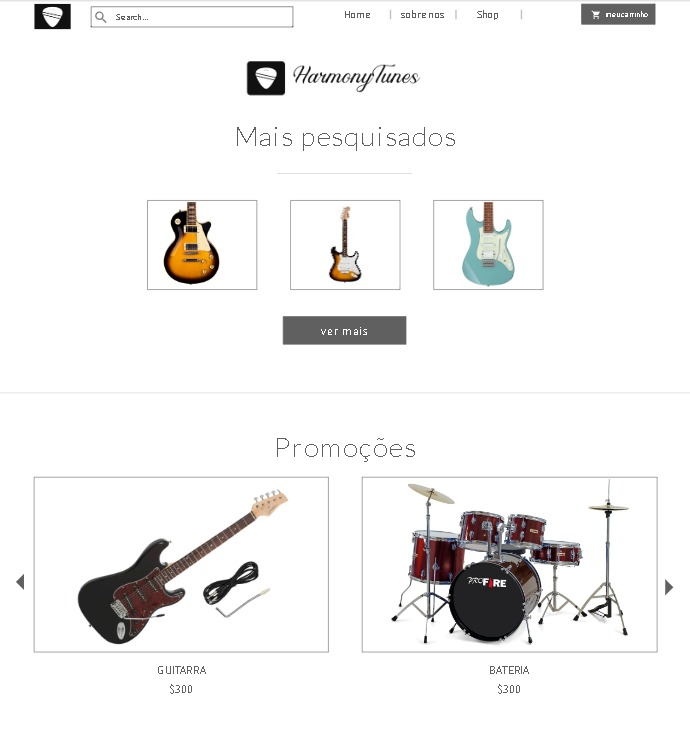
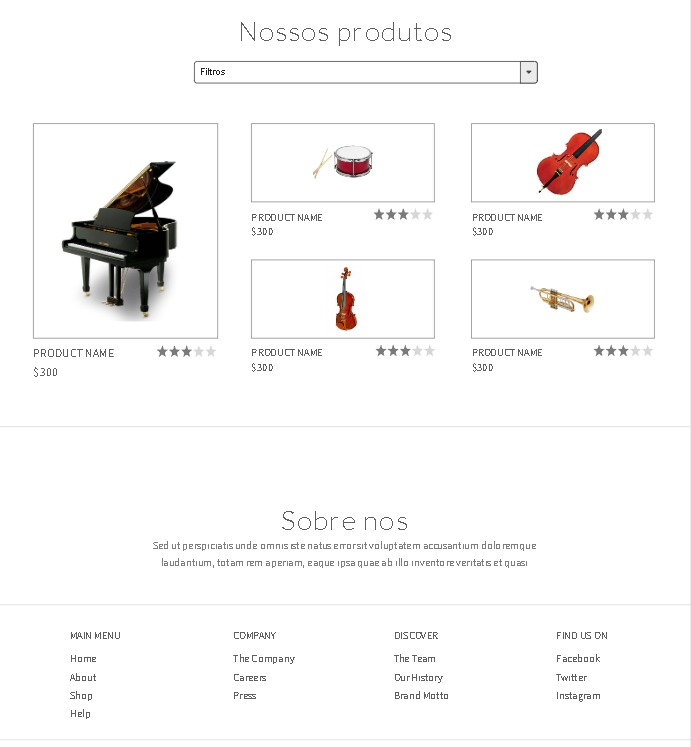
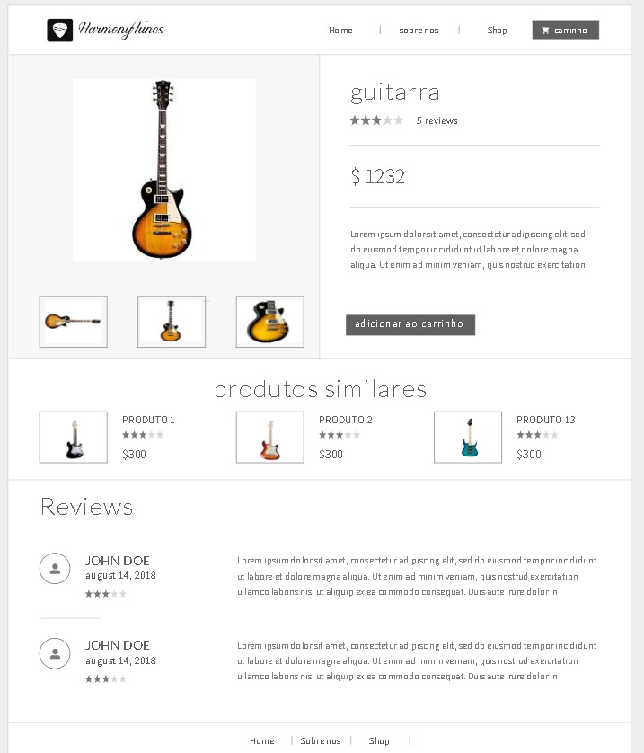
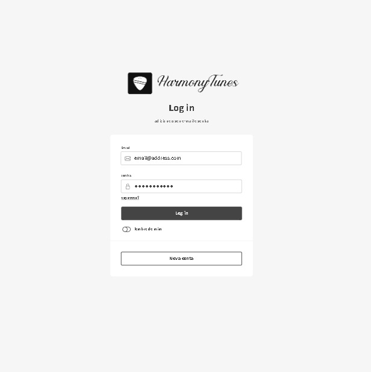
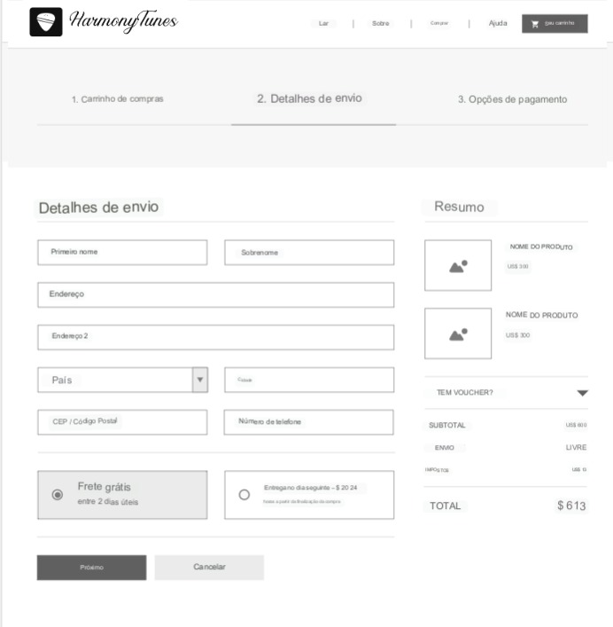

# Informações do Projeto
`TÍTULO DO PROJETO`  

......  HarmonyTunes ......

`CURSO` 

Projeto desenvolvido para a disciplina de Trabalho Interdisciplinar: Aplicações para Processos de Negócios do curso de Análise e desenvolvimento de sistemas da Pontifícia Universidade Católica de Minas Gerais.

## Participantes

>
> Os membros do grupo são: 
> <li>Gabriel Augusto Lana Vidal</li>
> <li>Gustavo Meira Becattini</li>
> <li>Luis Gustavo</li>
> <li>Messias Junio da Silva</li>
> <li>Pedro Henrique da Silva Araújo Queiroz</li>

# Estrutura do Documento

- [Informações do Projeto](#informações-do-projeto)
  - [Participantes](#participantes)
- [Estrutura do Documento](#estrutura-do-documento)
- [Introdução](#introdução)
  - [Problema](#problema)
  - [Objetivos](#objetivos)
  - [Justificativa](#justificativa)
  - [Público-Alvo](#público-alvo)
- [Especificações do Projeto](#especificações-do-projeto)
  - [Personas e Mapas de Empatia](#personas-e-mapas-de-empatia)
  - [Histórias de Usuários](#histórias-de-usuários)
  - [Requisitos](#requisitos)
    - [Requisitos Funcionais](#requisitos-funcionais)
    - [Requisitos não Funcionais](#requisitos-não-funcionais)
  - [Restrições](#restrições)
- [Projeto de Interface](#projeto-de-interface)
  - [User Flow](#user-flow)
  - [Wireframes](#wireframes)
- [Metodologia](#metodologia)
  - [Divisão de Papéis](#divisão-de-papéis)
  - [Ferramentas](#ferramentas)
  - [Controle de Versão](#controle-de-versão)
- [**############## SPRINT 1 ACABA AQUI #############**](#-sprint-1-acaba-aqui-)
- [Projeto da Solução](#projeto-da-solução)
  - [Tecnologias Utilizadas](#tecnologias-utilizadas)
  - [Arquitetura da solução](#arquitetura-da-solução)
- [Avaliação da Aplicação](#avaliação-da-aplicação)
  - [Plano de Testes](#plano-de-testes)
  - [Ferramentas de Testes (Opcional)](#ferramentas-de-testes-opcional)
  - [Registros de Testes](#registros-de-testes)
- [Referências](#referências)

# Introdução

## Problema

> O cenário atual na indústria de instrumentos musicais
> apresenta uma série de desafios que nosso projeto busca
> abordar de maneira inovadora e eficaz.

### **Carência de Lojas Online de Confiança e Qualidade**

Uma das questões centrais enfrentadas pelos entusiastas da música e músicos em desenvolvimento é a falta de opções confiáveis e de alta qualidade para adquirir instrumentos musicais online. O mercado tem demonstrado uma escassez de plataformas que ofereçam não apenas uma ampla variedade de instrumentos, mas também a garantia de que esses produtos sejam autênticos, bem conservados e funcionais. A ausência de lojas online de confiança tem levado os consumidores a hesitar em fazer compras online, temendo receber produtos de qualidade duvidosa ou até mesmo falsificados.

### **Falta de Preços Atrativos e Acessíveis**

Outro problema significativo enfrentado por músicos e aspirantes a músicos é a inacessibilidade financeira de muitos instrumentos musicais de qualidade. A indústria de instrumentos musicais muitas vezes apresenta preços exorbitantes, o que pode desencorajar indivíduos interessados em aprender ou progredir na música. A falta de opções de preços atrativos pode limitar o acesso à música e restringir a oportunidade para muitos de explorar sua paixão.

## Objetivos

### **Objetivo Geral:**
Criar um site de vendas de instrumentos musicais que ofereça uma experiência de compra única, de elementos musicais.

### **Objetivos Específicos:**

- Oferecer uma variedade de instrumentos musicais a preços acessíveis.
- Fornecer um ambiente online fácil de usar e intuitivo para os clientes navegarem e realizarem compras.
- Criar uma plataforma onde os entusiastas da música possam encontrar ofertas exclusivas.
- Estabelecer uma comunidade em torno do site, permitindo que os clientes compartilhem avaliações, dicas e experiências musicais.
- Promover a sustentabilidade ao oferecer instrumentos musicais recondicionados.

## Justificativa

### **Relevância de Mercado:**
A indústria de instrumentos musicais carece de uma plataforma online que ofereça uma combinação de descontos, diversão e um senso de comunidade. A criação desse outlet musical visa atender a essa necessidade.

### **Demanda Crescente por Instrumentos Acessíveis:**
Com o aumento da popularidade da música, há uma demanda crescente por instrumentos musicais acessíveis. Esse projeto visa fornecer uma solução para músicos em desenvolvimento e aficionados por música que buscam qualidade a preços mais baixos.

### **Valorização da Sustentabilidade:**
A reutilização de instrumentos musicais recondicionados não apenas oferece economia para os clientes, mas também promove a sustentabilidade, reduzindo o desperdício de recursos.

## Público-Alvo

O público-alvo é o grupo de pessoas para quem o site é direcionado. Compreender esse público é fundamental para moldar a estratégia de marketing e o design do site.

**Músicos Iniciantes, Amadores e Profissionais:**

- Pessoas que tocam instrumentos musicais por hobby.
- Músicos que desejam experimentar novos instrumentos sem gastar muito.
- Interessados em aprender a tocar instrumentos musicais.

**Colecionadores de Instrumentos:**

- Indivíduos que gostam de colecionar instrumentos variados.
- Aqueles que procuram adicionar peças às suas coleções.

**Compradores Conscientes:**

- Pessoas que buscam adquirir produtos recondicionados e sustentáveis.
- Consumidores que desejam economizar dinheiro sem comprometer a qualidade.

 
# Especificações do Projeto

O projeto tem como objetivo principal criar uma plataforma de comércio eletrônico exclusiva para a venda de utensílios e instrumentos musicais, visando proporcionar uma experiência rica e satisfatória para músicos de todos os níveis e amantes da música em geral. A plataforma será construída com base nas necessidades e expectativas das personas identificadas, garantindo a usabilidade, a funcionalidade e a qualidade em todas as etapas do desenvolvimento. Para que isso seja alcançado, serão aplicadas técnicas e ferramentas comuns em projetos de desenvolvimento de software, como:

### Abordagem de Desenvolvimento:

- A abordagem adotada para o desenvolvimento será centrada nas personas, a partir de uma compreensão profunda das necessidades, desejos e motivações de cada categoria de usuário.  As histórias de usuário, serão utilizadas para mapear as funcionalidades-chave do sistema a partir da perspectiva dos usuários. Isso nos ajudará a traduzir as necessidades identificadas em requisitos tangíveis e funcionais, garantindo que cada funcionalidade desenvolvida agregue valor real às personas.

### Análise de Requisitos:

- Análise de Requisitos: Identificaremos e documentaremos as necessidades dos usuários, as funcionalidades desejadas e os cenários de uso específicos.

### **Objetivo da Solução**

O objetivo central é garantir que a plataforma atenda plenamente às necessidades e expectativas dos usuários, oferecendo uma experiência eficiente e satisfatória. Buscaremos desenvolver o sistema de forma eficaz, garantindo a qualidade do software e a conformidade com os requisitos especificados.

## Personas e Mapas de Empatia

`Persona 1`

Miguel Cardoso - Designer gráfico

Miguel tem 25 anos e é um músico autodidata. Ele toca violão e teclado e adora experimentar diferentes estilos musicais. Miguel trabalha em tempo integral como designer gráfico e toca música como hobby nas horas vagas. Ele adora encontrar ofertas e oportunidades para adquirir novos instrumentos e equipamentos musicais a preços acessíveis. Miguel é muito ligado à comunidade musical local e sempre busca compartilhar suas experiências com outros músicos.

`Mapa de Empatia`

| O que a persona vê? | O que a persona ouve? | O que a persona pensa e sente? | O que a persona diz e faz? |
| --- | --- | --- | --- |
| Anúncios de lojas de instrumentos musicais nas redes sociais e sites relacionados. | Vídeos de demos de instrumentos no YouTube e playlists musicais variadas. | Está sempre em busca de maneiras de economizar dinheiro em novos equipamentos. | Nota promoções e preços mais baratos e verifica se os produtos podem ser utilizados por ele. |
| Produtos musicais de marcas reconhecidas com descontos significativos. | Podcasts sobre técnicas de gravação e entrevistas com músicos famosos. | Se sente empolgado com a possibilidade de melhorar suas habilidades musicais com novos equipamentos. | Verifica categorias de instrumentos e utiliza os filtros de pesquisa para encontrar opções de violões com um bom custo-benefício. |
| Avaliações de produtos por músicos renomados, mencionando a qualidade e durabilidade dos produtos. | Música ambiente tocando em sua playlist favorita enquanto trabalha. | Pensa em como seria incrível encontrar um instrumento de qualidade com um preço acessível para aprimorar suas performances ao vivo. | Compra um instrumento, mesmo que usado, se estiver em boas condições e com boas avaliações. |
| Ofertas sazonais e pacotes de acessórios com os instrumentos. | Seus próprios arranjos musicais e melodias quando toca seus instrumentos. | Quer ter instrumentos de qualidade sem gastar muito. | Compartilha sua experiência positiva com amigos músicos. |

**`Persona 2`**

Melissa Souza - Música

Melissa é uma jovem de 22 anos que está começando sua jornada como músico profissional. Ela toca guitarra e canta, e sonha em formar uma banda de rock alternativo. Está sempre em busca de equipamentos de qualidade para suas performances ao vivo e gravações, mas tem um orçamento limitado para investir em instrumentos. Ela é ativa nas redes sociais e participa de fóruns online para trocar experiências com outros músicos.

**`Mapa de Empatia`**

| O que a persona vê? | O que a persona ouve? | O que a persona pensa e sente? | O que a persona diz e faz? |
| --- | --- | --- | --- |
| Uma variedade de instrumentos musicais, de pianos e violinos a guitarras e baterias | O som de instrumentos musicais sendo tocados | Ansiosa para aprender a tocar um novo instrumento musical | Faz perguntas aos funcionários sobre instrumentos musicais |
| Funcionários bem informados que podem responder às suas perguntas sobre instrumentos musicais | Os funcionários dando explicações sobre os instrumentos musicais | Se sente um pouco sobrecarregada com as opções disponíveis e quer ter certeza de que está fazendo uma boa escolha. | Lê atentamente as descrições dos produtos e verifica se há a possibilidade de demonstração para ter uma ideia de como eles soam. |
| Um ambiente convidativo e tranquilo para aprender a tocar instrumentos musicais | Discussões online sobre os prós e contras de diferentes marcas e modelos. | Determinada a fazer uma compra informada e não quer se arrepender, ela quer encontrar instrumentos que possam durar por muito tempo. | Lê avaliações de músicos para obter informações adicionais sobre o produto. |
| Informações sobre eventos musicais locais e oportunidades para apresentações ao vivo. | Feedback e elogios de seus amigos músicos sobre suas próprias performances. | Sente uma mistura de empolgação e nervosismo ao procurar novos equipamentos. pois quer evoluir como música e impressionar quem a escuta. | Compartilha com amigos quando encontra algum instrumento ou acessório com preços acessíveis. |

**`Persona 3`**

João Pedro - Estudante universitário

João Pedro, 23 anos, é um estudante que adora tocar guitarra, assistir a shows de música e ir a festivais de música. Seu objetivo é encontrar um instrumento musical de boa qualidade que seja dentro do seu orçamento, mas ele tem dificuldades porque não tem conhecimento técnico sobre instrumentos musicais e não sabe onde encontrar um instrumento de boa qualidade. Suas necessidades incluem um instrumento musical que seja fácil de tocar e que possa tocar os estilos de música que gosta(rock & pop). Além disso, ele deseja encontrar um instrumento musical que seja único e que o ajude a se expressar musicalmente.

`Mapa de Empatia`

| O que a persona vê? | O que a persona ouve? | O que a persona pensa e sente? | O que a persona diz e faz? |
| --- | --- | --- | --- |
| Uma variedade de instrumentos musicais, de guitarras e baixos a baterias e teclados | O som de instrumentos musicais sendo tocados | Emocionado por encontrar um novo instrumento musical | Faz perguntas sobre instrumentos musicais |
| Funcionários informados que podem responder às suas perguntas sobre instrumentos musicais | Especialistas dando explicações sobre os instrumentos musicais | Nervoso por experimentar um instrumento musical pela primeira vez | Experimenta diferentes instrumentos musicais |
| Um ambiente convidativo e divertido para experimentar instrumentos musicais | Outros clientes conversando | Confiante de que encontrará o instrumento perfeito para si | Faz uma compra |

`Persona 4`

Jussara Rocha - Gerente de loja

Jussara tem 34 anos e é casada com um músico. Ela deseja surpreender o marido com um presente significativo que esteja ligado à sua paixão pela música. Assim, está em busca de uma loja confiável onde possa adquirir instrumentos musicais ou acessórios de alta qualidade, sem exceder seu orçamento.

`Mapa de Empatia`

| O que a persona vê? | O que a persona ouve? | O que a persona pensa e sente? | O que a persona diz e faz? |
| --- | --- | --- | --- |
| Instrumentos musicais em lojas físicas e online | Som do marido tocando música em casa | Empolgação, variedade de opções | Pesquisa por opções online e offline |
| Anúncios de música e instrumentos. | Comentários sobre música de amigos | Pressão para escolher algo adequado | Pergunta a amigos por recomendações |
| Marido tocando guitarra e outros instrumentos | Sugestões de músicas e artistas | Desejo de fazer um presente especial e significativo | Compara preços e avaliações |

`Persona 5`

Pablo Lacerda - Empresário

Pablo, um empresário de 45 anos, apaixonado por música, tem o objetivo de criar uma escola de música de renome. Para garantir a excelência no ensino, ele está determinado a adquirir instrumentos musicais e peças de alta qualidade. Sua visão é proporcionar aos alunos um ambiente inspirador e bem equipado para desenvolver seus talentos musicais. Pablo está comprometido em estabelecer parcerias com fornecedores confiáveis e experientes, a fim de garantir que sua escola de música ofereça instrumentos excepcionais para o aprendizado e a prática musical.

`Mapa de Empatia`

| O que a persona vê? | O que a persona ouve? | O que a persona pensa e sente? | O que a persona diz e faz? |
| --- | --- | --- | --- |
| Instrumentos musicais de alta qualidade em lojas físicas e online. | Música tocando por músicos talentosos | Empolgação em criar uma escola de música renomada e bem equipada. | Expressa sua visão de criar uma escola de música de alto padrão que valoriza a qualidade dos instrumentos. |
| Escolas de música bem-sucedidas com ambientes inspiradores. | Conversas sobre qualidade de instrumentos musicais. | Determinação em oferecer aos alunos um ambiente propício para o ensino musical de qualidade. | Investiga fornecedores confiáveis e marcas renomadas no mercado. |
| Anúncios e informações sobre marcas reconhecidas no setor musical. | Recomendações de empresários ou músicos experientes. | Pressão para tomar decisões certas na seleção de instrumentos. | Estabelece parcerias com especialistas e músicos experientes para orientação. |

`Persona 6`

Amélia -  Influenciadora digital

Amélia tem 19 anos e cria conteúdo musical, está atualmente em busca de peças de qualidade para renovar seus instrumentos musicais. Com a intenção de aprimorar seu som e visual, ela está dedicando tempo à pesquisa por acessórios que possam revitalizar seus instrumentos e torná-los mais atraentes para seu público.

`Mapa de Empatia`

| O que a persona vê? | O que a persona ouve? | O que a persona pensa e sente? | O que a persona diz e faz? |
| --- | --- | --- | --- |
| Peças e acessórios para instrumentos musicais de qualidade em lojas físicas e online. | Música sendo tocada por outros músicos e influenciadores. | Excitação para aprimorar seus instrumentos e criar conteúdo mais envolvente. | Compartilha descobertas e progresso em redes sociais, mostrando o processo de reforma e detalhes das peças adquiridas. |
| Conteúdo online de músicos reformando instrumentos e compartilhando dicas. | Conversas sobre reforma e melhorias em instrumentos. | Responsabilidade em manter a autenticidade no conteúdo. | Destaca a importância de cuidar bem de seus instrumentos e incentivando sua audiência a valorizar seus instrumentos. |
| Novidades em tecnologia e tendências relacionadas a reforma de instrumentos. | Feedback de seguidores sobre suas performances e conteúdo. | Preocupação em encontrar peças de qualidade que atendam suas necessidades e estética. | Comenta sobre sua paixão pela música e seu desejo de criar um som excepcional. |

## Histórias de Usuários

Com base na análise das personas forma identificadas as seguintes histórias de usuários:

| Eu como `PERSONA` | Quero/Preciso `FUNCIONALIDADE` | Para `MOTIVO/VALOR` |
| --- | --- | --- |
| Usuário do Sistema | Acessar o painel de administração para gerenciar produtos e promoções. | Manter o site atualizado com ofertas e produtos novos. |
| Cliente | Encontrar facilmente guitarras usadas de qualidade com preços acessíveis. | Adquirir um instrumento musical econômico para minhas práticas e apresentações. |
| Cliente | Pesquisar teclados musicais com uma variedade de sons para minhas composições. | Ter um teclado versátil que me permita explorar diferentes estilos musicais. |
| Gerente de Vendas | Acompanhar as métricas de vendas e estoque no sistema administrativo. | Tomar decisões informadas sobre estoque e promoções com base nos dados. |

## Requisitos

As tabelas que se seguem apresentam os requisitos funcionais e não funcionais que detalham o escopo do projeto.

### Requisitos Funcionais

|ID    | Descrição do Requisito  | Prioridade |
|------|-----------------------------------------|----|
|RF-001| <b>Sistema de venda de instrumentos musicais</b> | ALTA | 
|RF-002| <b>Pagamento online</b>   <i>Oferecer métodos de pagamento; Solicitar informações de entrega, como o endereço de envio);| MÉDIA |
|RF-003| <b>Cadastro de usuários</b>   <i>Permitir criação de contas pessoais; Solicitar informações como nome, email, senha e cpf. | ALTA | 
|RF-004| <b>Cadastro de produtos</b>   <i>Nome, marca, categoria, preço, estado(novo ou usado)  | MÉDIA |
|RF-005| <b>Avaliações e comentários dos produtos</b> | ALTA | 
|RF-006| <b>Navegação e Pesquisa</b>   <i>Barra de pesquisa para usuários buscarem instrumentos por nome, categoria ou marca; Filtro para refinar conteúdo, como preço, marca, categoria.   | MÉDIA |
|RF-007| <b>Listagem de produtos</b>   <i>Exibir informações sobre cada produto, incluindo Nome, Imagem, Descrição e Preço; Mostrar avaliações e comentários dos clientes(se disponíveis); Mostrar a disponibilidade atual do estoque. | ALTA | 
|RF-008| <b>Carrinho de compras</b>   <i>Permitir que os usuários adicionem produtos ao carrinho; Exibir o resumo dos itens do carrinho incluindo preço individual de cada produto e o valor total do pedido;   | MÉDIA |

### Requisitos não Funcionais

| ID | Descrição do Requisito | Prioridade |
| --- | --- | --- |
| RNF-001 | Desempenho | ALTA |
| RNF-002 | Segurança | ALTA |
| RNF-003 | Usabilidade e Experiência do Usuário | ALTA |
| RNF-004 | Disponibilidade | ALTA |
| RNF-005 | Responsividade | ALTA |
| RNF-006 | Acessibilidade | MÉDIA |

## Restrições

O projeto está restrito pelos itens apresentados na tabela a seguir.

|ID| Restrição                                             |
|--|-------------------------------------------------------|
|01| O projeto deverá ser entregue até o final do semestre |
|02| O projeto deverá ser hospedado em alguma plataforma online |
|03| Acesso à base de dados deve ser restrito apenas a usuários autorizados |
|04| O site deve ser totalmente responsivo, garantindo que os elementos se ajustem e sejam exibidos corretamente em diferentes dispositivos e tamanhos de tela |

# Projeto de Interface

O projeto, que se trata da criação de um site de venda de instrumentos musicais, também exigirá uma interface amigável, intuitiva e fácil de usar para os usuários. Essa interface deve permitir a busca e compra de instrumentos disponíveis, bem como a visualização de informações cruciais, como os tipos de instrumentos, preços, prazos e disponibilidade.

Com o intuito de atender a essas necessidades específicas, o site HarmonyTunes será dividido em cinco interfaces principais: a interface de visualização de produtos; a de busca e filtro de produtos; a de detalhes de um produto, quando selecionado; a de login; e a de finalização de compras.

A interface de visualização de produtos permitirá aos músicos explorar os instrumentos disponíveis de maneira conveniente, enquanto a interface de busca e filtro de produtos possibilitará a realização de buscas refinadas de acordo com critérios específicos, como tipo de instrumento, marca e faixa de preços. Uma vez selecionado um instrumento, a interface de detalhes apresentará informações detalhadas sobre o produto, incluindo descrição, especificações técnicas e imagens.

A interface de login proporcionará aos músicos acesso seguro às suas contas, permitindo que visualizem seu histórico de reservas anteriores e informações pessoais. Por fim, a interface de finalização de compras guiará os músicos pelo processo de reserva, incluindo a seleção de datas e detalhes de pagamento.

Esse design de interface diversificado e bem estruturado reflete o compromisso do projeto em proporcionar uma plataforma intuitiva e abrangente para a venda de instrumentos musicais, atendendo às necessidades e preferências de forma eficaz.

## User Flow

## Wireframes

> Home Page: 
>   
> Pagina de Filtros e Pesquisas: 
>   
> Página de detálhes do produto: 
>   
> Página de LogIn e Cadastro: 
>   
> Página de finalização de compras com form para dados do cliente: 
>  

# Metodologia

Durante o projeto, usaremos metodologias ágeis para trabalhar com mais flexibilidade e adaptabilidade. A equipe terá papéis e tarefas específicas para uma execução organizada e eficiente. Usaremos o Discord para comunicação e o GitHub para gerenciar configuração, versões, colaboração e correção de bugs.

Também será definido um horário para a aplicação do Daily Scrum.

## Divisão de Papéis

......  COLOQUE AQUI O SEU TEXTO ......
|              Nome                    |       Papel       |
|--|-------------------------------------------------------|
| Gabriel Augusto Lana Vidal |	`Dev FullStack` |
| Gustavo Meira Becattini	| `Dev FullStack`|
| Lucas Felipe Freitas de Oliveira |	`Dev FullStack` |
| Luis Gustavo Mendes Oliveira | `Dev FullStack` |
| Messias Junio da Silva |	`Dev FullStack` |
| Pedro Henrique da Silva Araújo Queiroz	| `Dev FullStack`, `Scrum Master` |

## Ferramentas

Segue na tabela abaixo as principais ferramentas usadas pela equipe durante o desenvolvimento do projeto:

| AMBIENTE | PLATAFORMA | LINK |
| --- | --- | --- |
| Edição de texto e documentação | Notion | https://www.notion.so/HarmonyTunes-1fab0dbfc55549bea5889436c0f38540?pvs=21 |
| Repositório de código | Github | https://github.com/PSG-TIAPN-2022-1/psg-tiapn-2023-2-harmonytunes |
| Userflow | Figma | https://www.figma.com/file/sjyGUX417EvSUPVFZ0QiWG/Untitled?type=design&node-id=2%3A4&mode=design&t=4roVIJUshYInwSS2-1   |
| Divisão e organização de tarefas | Trello | https://trello.com/b/QCfgpNkY/harmonytunes |
| Userflow e Wireframes | Canva | - |
| Visual Studio Code | Desenvolvimento de código | - |
| Teams / Discord | Comunicação | - |
| PhotoShop / Canva | Design | - |
| Heroku / Replit | Hospedagem | (indisponível no momento) |

> ### **Sobre nossas ferramentas:**
> -> O `Visual Studio Code` foi escolhido por ser hoje o mais utilizado no âmbito de web development, bem como o
>mais completo, além do fato dos integrantes do grupo já estarem familiarizados com ele.  
> -> As ferramentas de comunicação escolhidas foram o `Discord` e também o `Teams`, por já estarmos habituados ao seu uso.  
> -> O `Photoshop` será usado, quando se fizer necessário, para finalizar o design inicialmente feito pelo Canva.  
> -> A hospedagem do site será primariamente feita via `Heroku`, utilizando o `Replit` somente quando necessário.  
> -> utilizaremos o `Figma` por possuir ferramentas concretas para elaborarmos os esboços da aplicação.  
> -> O `Trello`será muito útil para distrubuírmos e gerenciarmos as tarefas.  
> -> Utilizaremos também o `Notion` para desenvolvermos a documentação necessária do projeto por ser muito versátil e prover diversas facilidades

## Controle de Versão

O controle de versão é uma parte essencial do processo de desenvolvimento de software que permite rastrear e gerenciar as alterações feitas no código-fonte ao longo do tempo. No projeto `Harmony Tunes`, adotamos o sistema de controle de versão Git, e utilizamos o `GitHub` como plataforma de hospedagem para o repositório `upstream`. Essa escolha nos proporciona uma série de benefícios, incluindo a facilidade de colaboração, rastreamento de mudanças e controle de versões.

### **Configuração do Projeto no GitHub**

O projeto`Harmony Tunes` é hospedado em um repositório no GitHub. A estrutura de gerenciamento de versão é organizada em diferentes `branches`, cada uma com um propósito específico:

- **`master`:** Esta é a branch de versão estável, que contém o código já testado e aprovado. É a versão do software pronta para produção.
- **`unstable`:** Nesta branch, mantemos a versão testada do software que ainda pode conter algumas instabilidades. É uma fase intermediária antes de ser promovida para a branch master.
- **`testing`:** Aqui, trabalhamos com a versão em teste do software, onde realizamos testes detalhados para identificar qualquer problema antes de avançar para as próximas etapas.
- **`dev`:** Esta branch é usada para desenvolvimento contínuo do software, onde novas funcionalidades são introduzidas e testadas.

### **Gerenciamento de Tags, Merges, Commits e Branches**

O processo de gerenciamento de código é baseado em boas práticas de versionamento e colaboração. Utilizamos tags para marcar versões específicas do software, permitindo uma maneira rápida e fácil de referenciar pontos de lançamento importantes.

Os commits são feitos de forma granular e descritiva, seguindo convenções de mensagens claras que indicam o propósito da alteração. Através do uso de pull requests e revisões de código, garantimos que as mudanças sejam revisadas e validadas por outros membros da equipe antes de serem mescladas nas branches principais.

O uso de branches permite que diferentes partes do desenvolvimento aconteçam paralelamente, enquanto ainda mantemos a estabilidade em nossas branches principais.

### **Gerência de Issues**

Para gerenciar as tarefas e melhorias no projeto, adotamos etiquetas que ajudam a categorizar e priorizar as issues:

- **`bugfix`:** Utilizada quando uma funcionalidade está com problemas ou bugs que precisam ser corrigidos.
- **`enhancement`:** Indica que uma funcionalidade existente precisa ser aprimorada.
- **`feature`:** Utilizada para introduzir uma nova funcionalidade no software.

### **Conclusão**

O uso do Git em conjunto com o GitHub nos proporciona um ambiente robusto para gerenciar as mudanças no código-fonte, facilitando a colaboração da equipe, o rastreamento de alterações e o desenvolvimento iterativo. A estrutura de branches, a etiquetagem de versões e as práticas de colaboração nos permitem manter um fluxo de desenvolvimento ordenado e eficaz do projeto.

# **############## SPRINT 1 ACABA AQUI #############**

# **Modelagem dos processos de Negócios**
Esta seção do relatório tem como objetivo apresentar uma análise detalhada da situação atual do nosso projeto. Essa análise resulta de reuniões da equipe em que revisamos o que já foi realizado até o momento e avaliamos os desafios e oportunidades que enfrentamos e analizar o que pode ser aprimorado. Além disso, buscamos compreender o mercado musical de forma mais abrangente, a fim de identificar áreas de aprimoramento para o nosso empreendimento.

`Estudo do Mercado Musical`
<ul>
  <li>Com um breve estudo do mercado atual da música, percebe-se um aumento na demanda por produtos de maior qualidade;</li>
  <li>A análise da “concorrência” destaca a necessidade de uma diferenciação dos produtos;</li>
  <li>Instrumentos musicais necessitam de frequente manutenção;</li>
  <li>Há também uma demanda maior no ramo em e-commerces, já que a maioria dos negócios investem mais em lojas físicas, e não se vê um grande e aquecido mercado online.</li>
</ul>

`Problemas e Desafios Identificados`

<b>1. Dificuldade em Encontrar Variedade e Qualidade de Instrumentos Musicais</b>
> Identificamos que há uma dificuldade significativa por parte dos consumidores em encontrar uma ampla variedade de instrumentos musicais de alta qualidade. Isso representa uma oportunidade para a nossa loja se destacar no mercado, oferecendo uma seleção diversificada de produtos de alto padrão, atendendo assim às necessidades dos músicos mais exigentes.

<b>2. Necessidade de Alcançar um Público Mais Amplo e de virtualizar o ambiente de vendas</b>
> Reconhecemos que o alcance de uma loja física é limitado em comparação com o potencial de um e-commerce, devido ao crescimento da demanda pelo serviço virtual. A utilização do o ambiente online nos permitirá atingir um público muito mais amplo, não apenas em nossa região, mas em todo o país.

<b>3. Escassez de Profissionais de Reparo e Luthiers de Qualidade</b>
> Observamos uma carência tanto por parte do público quanto da nossa empresa em encontrar profissionais de reparo e luthiers de alta qualidade. Esta é uma área em que podemos considerar a possibilidade de estabelecer parcerias com profissionais, oferecendo aos nossos clientes serviços confiáveis de manutenção e reparo para seus instrumentos musicais.

<b>4. Atendimento Ao Cliente Online</b>
> Configurar um sistema de atendimento ao cliente online, como chat ao vivo ou suporte por e-mail, requer planejamento e treinamento para garantir um serviço eficaz.

<b>5. Desafio logístico</b>
> A entrega de instrumentos musicais exige uma atenção maior, devido ao seu volume e fragilidade, é um desafio.

## **Descrição dos processos**
> O primeiro diagrama representa o modelo primitivo (AS-IS) do nosso projeto
> 

# Projeto da Solução

......  COLOQUE AQUI O SEU TEXTO ......

## Tecnologias Utilizadas

......  COLOQUE AQUI O SEU TEXTO ......

> Descreva aqui qual(is) tecnologias você vai usar para resolver o seu
> problema, ou seja, implementar a sua solução. Liste todas as
> tecnologias envolvidas, linguagens a serem utilizadas, serviços web,
> frameworks, bibliotecas, IDEs de desenvolvimento, e ferramentas.
> Apresente também uma figura explicando como as tecnologias estão
> relacionadas ou como uma interação do usuário com o sistema vai ser
> conduzida, por onde ela passa até retornar uma resposta ao usuário.
> 
> Inclua os diagramas de User Flow, esboços criados pelo grupo
> (stoyboards), além dos protótipos de telas (wireframes). Descreva cada
> item textualmente comentando e complementando o que está apresentado
> nas imagens.

## Arquitetura da solução

......  COLOQUE AQUI O SEU TEXTO E O DIAGRAMA DE ARQUITETURA .......

> Inclua um diagrama da solução e descreva os módulos e as tecnologias
> que fazem parte da solução. Discorra sobre o diagrama.
> 
> **Exemplo do diagrama de Arquitetura**:
> 
> 

# Avaliação da Aplicação

......  COLOQUE AQUI O SEU TEXTO ......

> Apresente os cenários de testes utilizados na realização dos testes da
> sua aplicação. Escolha cenários de testes que demonstrem os requisitos
> sendo satisfeitos.

## Plano de Testes

......  COLOQUE AQUI O SEU TEXTO ......

> Enumere quais cenários de testes foram selecionados para teste. Neste
> tópico o grupo deve detalhar quais funcionalidades avaliadas, o grupo
> de usuários que foi escolhido para participar do teste e as
> ferramentas utilizadas.
> 
> **Links Úteis**:
> - [IBM - Criação e Geração de Planos de Teste](https://www.ibm.com/developerworks/br/local/rational/criacao_geracao_planos_testes_software/index.html)
> - [Práticas e Técnicas de Testes Ágeis](http://assiste.serpro.gov.br/serproagil/Apresenta/slides.pdf)
> -  [Teste de Software: Conceitos e tipos de testes](https://blog.onedaytesting.com.br/teste-de-software/)

## Ferramentas de Testes (Opcional)

......  COLOQUE AQUI O SEU TEXTO ......

> Comente sobre as ferramentas de testes utilizadas.
> 
> **Links Úteis**:
> - [Ferramentas de Test para Java Script](https://geekflare.com/javascript-unit-testing/)
> - [UX Tools](https://uxdesign.cc/ux-user-research-and-user-testing-tools-2d339d379dc7)

## Registros de Testes

......  COLOQUE AQUI O SEU TEXTO ......

> Discorra sobre os resultados do teste. Ressaltando pontos fortes e
> fracos identificados na solução. Comente como o grupo pretende atacar
> esses pontos nas próximas iterações. Apresente as falhas detectadas e
> as melhorias geradas a partir dos resultados obtidos nos testes.

# Referências

......  COLOQUE AQUI O SEU TEXTO ......

> Inclua todas as referências (livros, artigos, sites, etc) utilizados
> no desenvolvimento do trabalho.
> 
> **Links Úteis**:
> - [Formato ABNT](https://www.normastecnicas.com/abnt/trabalhos-academicos/referencias/)
> - [Referências Bibliográficas da ABNT](https://comunidade.rockcontent.com/referencia-bibliografica-abnt/)
